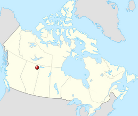

# Flood

`Flood` is an application that delinates basins on a digital terrain 
model (DTM) and attempts to locate the 'spill points' between them.

## Background

Typical watershed and channel delination techniques us a least-cost 
search algorithm to locate the path that a hypothetical water droplet 
will follow as it moves down slope. This algorithm "floods" basins, 
from user-defined seeds or surface minima, and locates the 
pixels on their edges which are within a specified distance of
each other. When such pairs of pixels are found, the least-cost path
(A*) between them is found and recorded as a *potential* spill path,
along with the flood elevation and the maximum height attained by
the path.

 This algorithm was inspired by the unique hydrological conditions ([1](https://onlinelibrary.wiley.com/doi/abs/10.1002/hyp.6420), [2](https://link.springer.com/article/10.1007/s11273-005-1114-1))
that prevail in the [Peace-Athabasca Delta](https://en.wikipedia.org/wiki/Peace%E2%80%93Athabasca_Delta) of Northern Alberta, Canada:
the Delta is littered with "perched" basins that recharge neither
from precipitation nor groundwater, but from overland spillage due to ice jam
flooding from the Peace and Athabasca Rivers. 

The relief of the delta is extraordinarily flat. Excluding Shield outcrops, 
over the 5000km2 expanse of the Delta, the elevation change might be 1-2m. For 
each basin, there is a definite least-cost path, according to the algorithm 
(there can't not be!) but this strategy isn't necessarily reflective of 
real-world processes. The `Flood` algorithm is designed to suggest the locations
and elevations of *likely* spill points.

This work was begun as part of an internship with [Dr. Daniel Peters](https://profils-profiles.science.gc.ca/en/profile/daniel-l-peters-phd-pgeo), with 
Environment and Climate Change Canada's [Water and Climate Impacts Research 
Centre](https://www.uvic.ca/research/centres/wcirc/) (W-CIRC) at the University of Victoria.

## Operation

`Flood` takes as input a DTM and an optional list of seed points representing locations
within basins. If seeds are not provided, the minima in the raster are used. Starting from the `start`
elevation and ending at the `end`, the program iteratively
fills pixels below the current elevation using the [flood fill](https://en.wikipedia.org/wiki/Flood_fill) algorithm. 
At each iteration, the current elevation is increased by the value of the `step`.
Regions of filled pixels comprise a "basin" and are given the ID of the seed point. A minimum basin
area filters out basins that are too small to be of interest (as they grow, basins are rapidly
subsumed by neighbouring basins so that the many initial seeds coalesce into a more manageable
number of basins). 

At each iteration, the edge pixels of each basin are placed in a [quadtree](https://en.wikipedia.org/wiki/Quadtree), 
one for each basin. Pairs of trees are searched for pixels within a configured range. For each pair,
the [A* least-cost search](https://en.wikipedia.org/wiki/A*_search_algorithm) is used to find the lowest-elevation path from one basin to the other. The end points,
the path geometry, the current elevation, and the maximum elevation traversed by the path are recorded.

The program also outputs a series of integer rasters, one for each elevation, containing the 
delinated basins. The pixel values are the IDs of the original seeds. Optionally, basins 
can be vectorized and output to files or a spatial database (PostGIS), though this step can be time-
consuming.

Spill points and path geometries can be output to a CSV file (with line geometries represented
as WKT linestrings) or to a spatial database.
 
### Algorithm

1. Choose a starting elevation, a minimum spill distance and (optionally) a minimum basin area. 
 * The starting elevation is the elevation below which no interesting connections are likely to occur.
 * The spill distance is the maximum distance between basins which would be considered near enough to possibly connect.
 * If the algorithm is to use all minima as seeds, select a minimum basin area to eliminate tiny basins which are likely to be subsumed by larger basins early in the process.
2. Beginning at each seed, “flood” the area around it in the DTM by filling all pixels lower than the chosen flood elevation using the well-known flood-fill algorithm (also known as the “forest fire” algorithm) (Torbert, 2016)⁠. For each basin, assign the value of the seed’s ID
to the filled pixels for that basin. This produces a new integer raster containing contiguous filled
regions representing basins.
3. Using a 9-element kernel, locate all of the edge pixels of each filled basin from the integer
raster. An edge cell is one that is either on the edge of the raster, or one for which the kernel
finds a neighbour pixel whose value differs from the value of the center pixel, whether this be
no data, or the ID of a neighbouring basin. This method will match the edges of interior holes in
a basin, but this is desirable, as a basin can theoretically occur within another basin.
4. Place the coordinates of each edge pixel of each basin into a separate KD-tree (Bentley, 1975)⁠ or quadtree 
corresponding to that basin. A tree data structure is selected because the number of edge cells
could be extremely large. The expected run time for the search phase would be O(n^2) with a
naive list comparison, and only O(n) for the KD-tree in the worst case. The expected running
time for the KD-tree is O(logn). The space complexity of either solution is O(n), so the overhead
associated with building and storing a tree for each basin is worthwhile. Each tree will be
identified with the ID of the basin.
5. Iterate over the list of distinct pairs of seeds. For all edge pixels in the tree corresponding to a
seed, find the nearest pixel in the tree corresponding to the paired seed.
6. Perform an A* least-cost search across the DTM for each pair of edge pixels selected in step 5
whose Cartesian distance is less than the minimum spill distance selected in step 1. The heuristic
for the search will minimize elevation gain along the path. This will connect each pair of pixels
along the path most easily followed by the hypothetical drop of water, rather than a simple
straight line. Note that any path that intersects a filled basin must be discarded – only those that
cross un-filled space are kept. While constructing the line, record the maximum elevation
reached by the line, and the coordinate of that point. This will indicate the spill location.
7. Add the lines produced in step 6 to a database, along with the IDs of the two basins, the fill
elevation and the coordinate and elevation of the spill point. Geometries for the line, and for
the spill point may be constructed if the database is spatially enabled.
Increment the flood elevation chosen in step 1 and repeat from step 2.

## Installation

`Flood` is designed to run on Linux systems, using the usual `cmake` process:

1) `$ git clone https://github.com/rskelly/flood`
2) `$ cd flood && mkdir build && cd build`
3) `$ cmake ..`
4) `$ make && sudo make install`

Run `flood` to see a usage message.

## Howto

The usage message printed by `flood` provides a listing of parameters available to users:

    Usage: flood <options>
     -i <file>            Input elevation raster.
     -s <file>            CSV containing seed points. Row format: gid, x, y, priority. If not given, minima are used.
     -dbc <conn>          The database connection string for output vectors.
     -dbl <layer>         The basin database layer name.
     -dbi <field>         The basin database ID field.
     -dbe <field>         The basin database elevation field.
     -dsl <layer>         The spill database layer name.
     -dsi <field>         The spill database ID field.
     -dse <field>         The spill database elevation field.
     -dsm <field>         The spill database maximum elevation field.
     -dsb <field1,field2> The basin ID fields. Comma-separated list of two column names.
     -v <dir>             Directory for basin vectors. If not given, they are not produced.
     -r <dir>             Directory for basin rasters. If not given, they are produced.
     -p <file>            Spill point file. If not given, they are not produced. A Shapefile or CSV.
     -start <e>           Starting elevation, in same units as input raster times 10^precision. 
                          So 200m becomes 200000 if the precision is 3 (the default).
     -end <e>             Ending elevation. Same precision rule as for start.
     -step <e>            Step elevation. Same precision rule as for start.
     -t <t>               Number of threads to use. Default 1.
     -b <a>               Minimum basin area.
     -d <d>               Maximum spill distance.
     -m                   Use file-backed memory for intermediate rasters.
     -bl <x0,y0,x1,y1,z>  Add a break line of the specified height. In the form <x0,y0,x1,y1,height>.
     -o                   If given, each elevation will be computed even if raster file exists.
                          Otherwise, the elevation will be skipped.
     -a <b>               The source raster band. Default 1.
     -c 
               The precision; the number of decimal places to use. Default 3 (mm precision,
                          when using metric).
     -g <alpha,radius>    Smooth the raster.

The basic workflow for generating flood basin extents and spill points is as follows:
<ol>
<li>Open your favourite GIS program and load a digital elevation, or digital terrain model (DEM or DTM).</li>
<li>In the GIS program, create some "seed" points. In QGIS, you would select the "New Temporary Scratch Layer" tool, set the Geometry Type field to "Point" and set the coordinate reference system to that of the DTM. Add a new text field called "name". Create points by clicking in the deepest parts of the basins you would like to "connect."</li>
<li>Save the temporary seed points layer as a CSV file. The file produced by QGIS will need some modification to be compatible with `flood`. The QGIS output fields will be "X", "Y" and "name", plus any additional fields you added to the layer. Add a column, "gid", with integer values starting at one and incrementing by 1. Rename the "X" and "Y" columns to "x" and "y" (lower case).</li>
<li>Determine the elevation range to "flood": the minimum elevation is where the program starts; choose an elevation low enough that the basins you've seeded are definitely separate. The maximum elevation is where the basins are definitely connected. Be careful not to place the minimum too low or the maximum too high -- you may end up creating many pointless layers.</li>
<li>Determine a reasonable "step". The step is the amount by which the flood elevation increments on each iteration. If you start at 210m and end at 211m, a step of 1cm will require 100 iterations and produce 100 basin layers.</li>
<li>Execute the program. Using the inputs created in the previous steps, a minimal execution will look like,
<pre>flood -i my_dem.tif -s my_seeds.csv -v basin_vectors -r basin_rasters -start 210000 -end 211000 -step 10 -d 100 </pre></li>
</ol>

## Eye Candy

Click image to view on Youtube.
